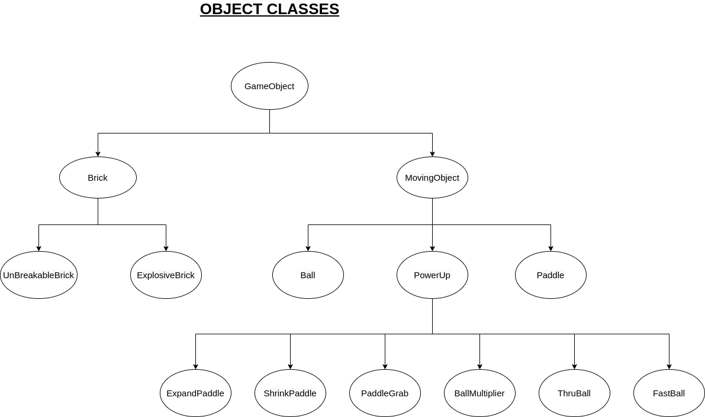
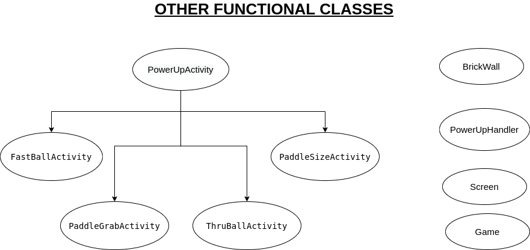

# Brick-Wrecker

## Overview

The game is inspired from the old classic brick breaker game similar
to [this](https://www.youtube.com/watch?v=BXEk0IHzHOM). The player will be using a paddle with a
bouncing ball to smash a wall of bricks and make high scores! The objective of the game is to break
all the bricks as fast as possible and beat the highest score! You lose a life when the ball touches
the ground below the paddle.

### Installation

Ensure that you have python3.6+ and pip.

Set up and activate virtual environment (optional).

```shell
$ python -m venv env
$ source env/bin/activate
```

Install the required packages.

```shell
$ pip install -r requirements.txt
```

Run the following to play the game. Also ensure that you play the game in full screen mode in
terminal.

```shell
$ python src/main.py
```


### Controls

- <kbd>A</kbd>: Move paddle left
- <kbd>D</kbd>: Move paddle right
- <kbd>S</kbd>: Skip Level
- <kbd>SPACE</kbd>: Release ball
- <kbd>Q</kbd>: Quit Game

### Classes

Refer to the diagrams below to view the class structure

\
 \
\
\


## OOP

### Abstraction

Methods like `MovingObject.move()`, `BrickWall.destroy_brick()`, `Screen.show()`, `Game._start()`,
`PowerUpActivity.activate()`
`PowerUpActivity.deactivate()`, etc., hide away the details and make the code more readable and
organized.

### Encapsulation

The entire game is modelled using classes and objects which encapsulate logically different
entities. They are functions and variables which are marked as private , protected as well as
public.

### Inheritance

Refer to the diagrams above

### Polymorphism

The `PowerUpActivity.activate()` , `PowerUpActivity.deactivate()` methods have been overridden
by `PowerUpActivity` subclasses. Further more, `MovingObject.move()` and `GameObject.set_emoji()`
are 2 more methods which have been overridden by `Paddle`, `Ball` and `Brick`. This example of
*method overriding* represents polymorphism. Some more examples are also present in the code.